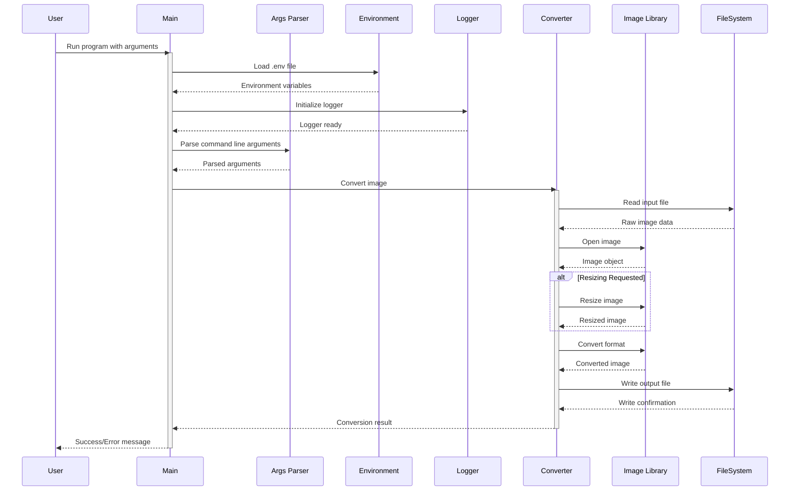
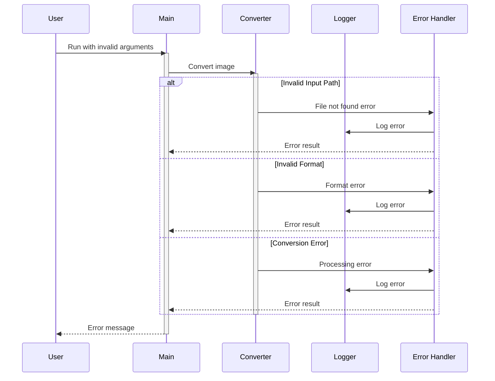
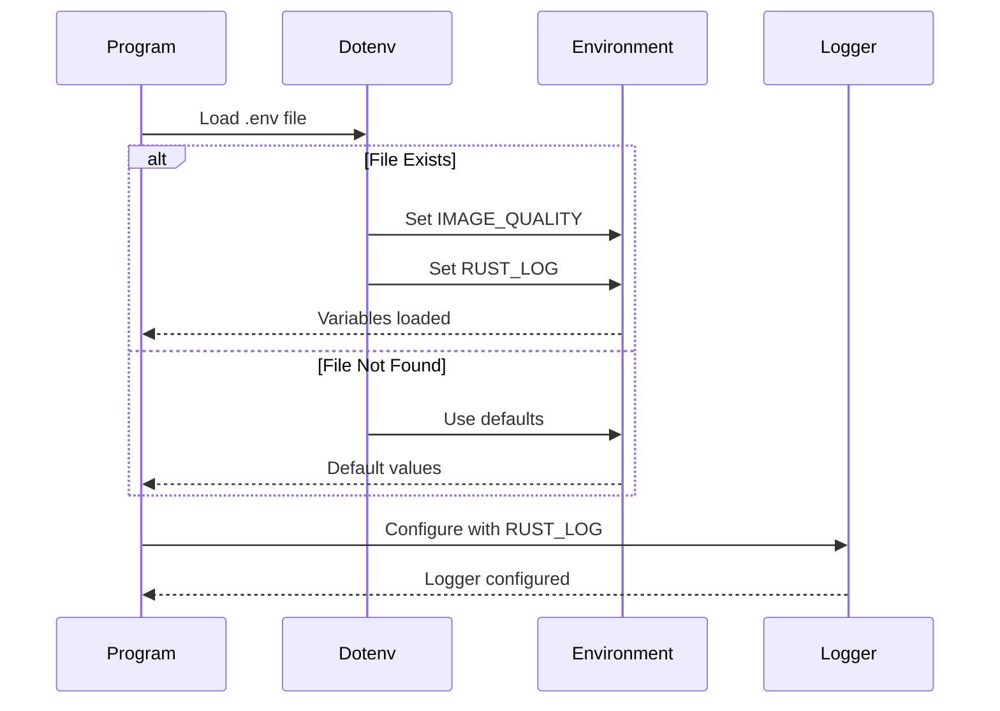
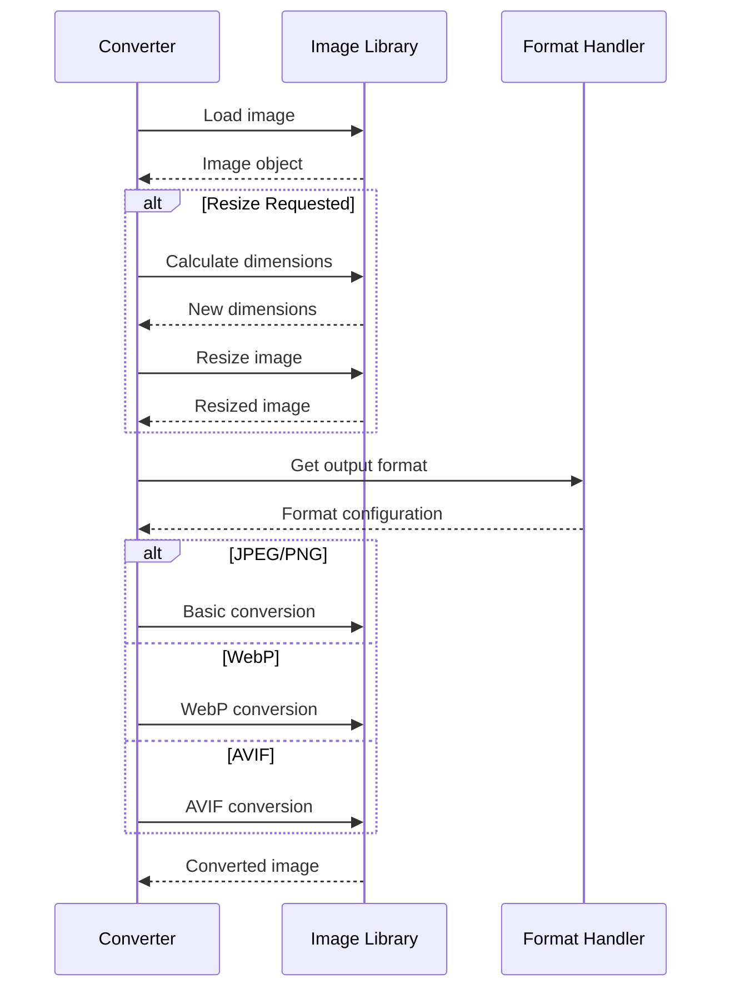

# Image Converter - Sequence Diagram Documentation

This document illustrates the sequence flow of the image converter utility using UML sequence diagrams.

## Main Program Flow

## Error Handling Flow

## Environment Configuration Flow

## Image Processing Flow

These sequence diagrams illustrate:
1. The main program flow from user input to output
2. Error handling pathways
3. Environment configuration process
4. Detailed image processing steps

The diagrams show the interaction between different components of the system and how data flows through the application during the image conversion process.
